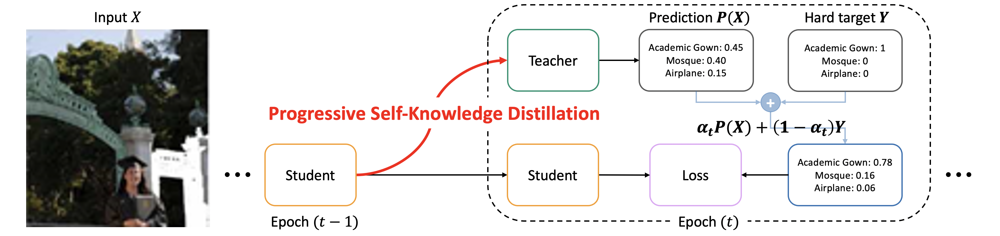

[](https://www.lgcns.com/En/Home)
[](https://pytorch.org/)

# Self-Knowledge Distillation with Progressive Refinement of Targets (PS-KD)
**Accepted at ICCV 2021, oral presentation**
* Official PyTorch implementation of **Self-Knowledge Distillation with Progressive Refinement of Targets (PS-KD)**.  
[[`Slides`](https://drive.google.com/file/d/1B3EVWjvBwoNyEvFEfFW0FkFxTQWRun--/view?usp=sharing)] [[`Paper`](https://openaccess.thecvf.com/content/ICCV2021/html/Kim_Self-Knowledge_Distillation_With_Progressive_Refinement_of_Targets_ICCV_2021_paper.html)] [[`Video`](https://drive.google.com/file/d/1QxqSbzn-egdYI13IYn3W4dmIvm_Iw4ku/view?usp=sharing)]
* ****Kyungyul Kim, ByeongMoon Ji, Doyoung Yoon and Sangheum Hwang****

## Abstract
The generalization capability of deep neural networks has been substantially improved by applying a wide spectrum of regularization methods, e.g., restricting function space, injecting randomness during training, augmenting data, etc. In this work, we propose a simple yet effective regularization method named ***progressive self-knowledge distillation*** **(PS-KD)**, which progressively distills a model's own knowledge to soften hard targets (i.e., one-hot vectors) during training. Hence, it can be interpreted within a framework of knowledge distillation as a student becomes a teacher itself. Specifically, targets are adjusted adaptively by combining the ground-truth and past predictions from the model itself. Please refer to the paper for more details.
<p align="center">

</p>

## Requirements
We have tested the code on the following environments: 
* Python 3.7.7 / Pytorch (>=1.6.0) / torchvision (>=0.7.0)

## Datasets
Currently, only **CIFAR-100**, **ImageNet** dataset is supported.

#) To verify the effectivness of PS-KD on Detection task and Machine translation task, we used   
   * For object detection: Pascal VOC
   * For machine translation: IWSLT 15 English-German / German-English, Multi30k. 
   * (Please refer to the paper for more details)

## How to Run
### Single-GPU Training
To train a model on single-GPU, run the command as follows:
```bash
$ CUDA_VISIBLE_DEVICES='<GPU ID>' python3 main.py --lr 0.1 \
                  --lr_decay_schedule 150 225 \
                  --PSKD \
                  --experiments_dir '<set your own path>' \
                  --batch_size 128 \
                  --classifier_type 'ResNet18' \
                  --data_path '<root your own data path>' \
                  --data_type '<cifar100 or imagenet>' \
                  --alpha_T 0.8 \
```
### Single-node & Multi-GPU Training
To train a model with 1 nodes & multi-GPU, run the command as follows:
```bash
$ CUDA_VISIBLE_DEVICES='<GPU IDs>' python3 main.py --lr 0.1 \
                  --lr_decay_schedule 150 225 \
                  --PSKD \
                  --experiments_dir '<set your own path>' \
                  --batch_size 128 \
                  --classifier_type 'ResNet18' \
                  --data_path '<root your own data path>' \
                  --data_type '<cifar100 or imagenet>' \
                  --alpha_T 0.8 \
                  --rank 0 \
                  --world_size 1 \
                  --multiprocessing_distributed
```
### Multi-node Training
To train a model with 2 nodes, for instance, run the commands below in sequence:
```bash
# on the node #0
$ CUDA_VISIBLE_DEVICES='<GPU IDs>' python3 main.py --lr 0.1 \
                  --lr_decay_schedule 150 225 \
                  --PSKD \
                  --experiments_dir '<set your own path>' \a
                  --batch_size 64 \
                  --classifier_type 'ResNet18' \
                  --data_path '<root your own data path>' \
                  --data_type '<cifar100 or imagenet>' \
                  --alpha_T 0.8 \
                  --rank 0 \
                  --world_size 2 \
                  --dist_url tcp://{master_ip}:{master_port} \
                  --multiprocessing_distributed
```
```bash
# on the node #1
$ CUDA_VISIBLE_DEVICES='<GPU IDs>' python3 main.py --lr 0.1 \
                  --lr_decay_schedule 150 225 \
                  --PSKD \
                  --experiments_dir '<set your own path>' \
                  --batch_size 64 \
                  --classifier_type 'ResNet18' \
                  --data_path '<root your own data path>' \
                  --data_type '<cifar100 or imagenet>' \
                  --alpha_T 0.8 \
                  --rank 1 \
                  --world_size 2 \
                  --dist_url tcp://{master_ip}:{master_port} \
                  --multiprocessing_distributed
```
## Saving & Loading Checkpoints
### Saved Filenames
* `save_dir` will be automatically determined(with sequential number suffixes) unless otherwise designated.
* Model's checkpoints are saved in `./{experiments_dir}/models/checkpoint_{epoch}.pth`.
* The best checkpoints are saved in `./{experiments_dir}/models/checkpoint_best.pth`.
### Loading Checkpoints (resume)
* Pass model path as a `--resume` argument

## Experimental Results
### Performance measures
* Top-1 Error / Top-5 Error
* Negative Log Likelihood (NLL)
* Expected Calibration Error (ECE)
* Area Under the Risk-coverage Curve (AURC)

### Results on CIFAR-100

| Model + Method                               | Dataset   | Top-1 Error | Top-5 Error | NLL      | ECE      | AURC      |
|----------------------------------------------|:---------:|:-----------:|:-----------:|:--------:|:--------:|:---------:|
| PreAct ResNet-18 (baseline)                  | CIFAR-100 | 24.18       | 6.90        | 1.10     | 11.84    | 67.65     |
| PreAct ResNet-18 + Label Smoothing           | CIFAR-100 | 20.94       | 6.02        | 0.98     | 10.79    | 57.74     |
| PreAct ResNet-18 + CS-KD [[CVPR'20][cs-kd]]  | CIFAR-100 | 21.30       | 5.70        | 0.88     | 6.24     | 56.56     |
| PreAct ResNet-18 + TF-KD [[CVPR'20][tf-kd]]  | CIFAR-100 | 22.88       | 6.01        | 1.05     | 11.96    | 61.77     |
| PreAct ResNet-18 + **PS-KD**                 | CIFAR-100 | **20.82**   | **5.10**    | **0.76** | **1.77** | **52.10** |
| PreAct ResNet-101 (baseline)                 | CIFAR-100 | 20.75       | 5.28        | 0.89     | 10.02    | 55.45     |
| PreAct ResNet-101 + Label Smoothing          | CIFAR-100 | 19.84       | 5.07        | 0.93     | **3.43** | 95.76     |
| PreAct ResNet-101 + CS-KD [[CVPR'20][cs-kd]] | CIFAR-100 | 20.76       | 5.62        | 1.02     | 12.18    | 64.44     |
| PreAct ResNet-101 + TF-KD [[CVPR'20][tf-kd]] | CIFAR-100 | 20.13       | 5.10        | 0.84     | 6.14     | 58.8      |
| PreAct ResNet-101 + **PS-KD**                | CIFAR-100 | **19.43**   | **4.30**    | **0.74** | 6.92     | **49.01** |
| DenseNet-121 (baseline)                      | CIFAR-100 | 20.05       | 4.99        | 0.82     | 7.34     | 52.21     |
| DenseNet-121 + Label Smoothing               | CIFAR-100 | 19.80       | 5.46        | 0.92     | 3.76     | 91.06     |
| DenseNet-121 + CS-KD [[CVPR'20][cs-kd]]      | CIFAR-100 | 20.47       | 6.21        | 1.07     | 13.80    | 73.37     |
| DenseNet-121 + TF-KD [[CVPR'20][tf-kd]]      | CIFAR-100 | 19.88       | 5.10        | 0.85     | 7.33     | 69.23     |
| DenseNet-121 + **PS-KD**                     | CIFAR-100 | **18.73**   | **3.90**    | **0.69** | **3.71** | **45.55** |
| ResNeXt-29 (baseline)                        | CIFAR-100 | 18.65       | 4.47        | 0.74     | **4.17** | 44.27     |
| ResNeXt-29 + Label Smoothing                 | CIFAR-100 | 17.60       | 4.23        | 1.05     | 22.14    | 41.92     |
| ResNeXt-29 + CS-KD [[CVPR'20][cs-kd]]        | CIFAR-100 | 18.26       | 4.37        | 0.80     | 5.95     | 42.11     |
| ResNeXt-29 + TF-KD [[CVPR'20][tf-kd]]        | CIFAR-100 | 17.33       | 3.87        | 0.74     | 6.73     | 40.34     |
| ResNeXt-29 + **PS-KD**                       | CIFAR-100 | **17.28**   | **3.60**    | **0.72** | 9.18     | **40.19** |
| PyramidNet-200 (baseline)                    | CIFAR-100 | 16.80       | 3.69        | 0.73     | 8.04     | 36.95     |
| PyramidNet-200 + Label Smoothing             | CIFAR-100 | 17.82       | 4.72        | 0.89     | 3.46     | 105.02    |
| PyramidNet-200 + CS-KD [[CVPR'20][cs-kd]]    | CIFAR-100 | 18.31       | 5.70        | 1.17     | 14.70    | 70.05     |
| PyramidNet-200 + TF-KD [[CVPR'20][tf-kd]]    | CIFAR-100 | 16.48       | 3.37        | 0.79     | 10.48    | 37.04     |
| PyramidNet-200 + **PS-KD**                   | CIFAR-100 | **15.49**   | **3.08**    | **0.56** | **1.83** | **32.14** |


### Results on ImageNet

| Model +Method                                       | Dataset  | Top-1 Error | Top-5 Error | NLL      | ECE      | AURC      |
|-----------------------------------------------------|:--------:|:-----------:|:-----------:|:--------:|:--------:|:---------:|
| DenseNet-264*                                       | ImageNet | 22.15       | 6.12        | --       | --       | --        |
| ResNet-152                                          | ImageNet | 22.19       | 6.19        | 0.88     | 3.84     | 61.79     |
| ResNet-152 + Label Smoothing                        | ImageNet | 21.73       | 5.85        | 0.92     | 3.91     | 68.24     |
| ResNet-152 + CS-KD [[CVPR'20][cs-kd]]               | ImageNet | 21.61       | 5.92        | 0.90     | 5.79     | 62.12     |
| ResNet-152 + TF-KD [[CVPR'20][tf-kd]]               | ImageNet | 22.76       | 6.43        | 0.91     | 4.70     | 65.28     |
| ResNet-152 + PS-KD                                  | ImageNet | **21.41**   | **5.86**    | **0.84** | **2.51** | **61.01** |

&#42; denotes results reported in the original papers

## Citation
If you find this repository useful, please consider giving a star :star: and citation PS-KD:
```
@InProceedings{Kim_2021_ICCV,
    author    = {Kim, Kyungyul and Ji, ByeongMoon and Yoon, Doyoung and Hwang, Sangheum},
    title     = {Self-Knowledge Distillation With Progressive Refinement of Targets},
    booktitle = {Proceedings of the IEEE/CVF International Conference on Computer Vision (ICCV)},
    month     = {October},
    year      = {2021},
    pages     = {6567-6576}
}
```
## Contact for Issues
* ByeongMoon Ji, jibm@lgcns.com
* Kyungyul Kim, kyungyul.kim@lgcns.com
* Doyoung Yoon, dy0916@lgcns.com

## License
```
Copyright (c) 2021-present LG CNS Corp.

Permission is hereby granted, free of charge, to any person obtaining a copy
of this software and associated documentation files (the "Software"), to deal
in the Software without restriction, including without limitation the rights
to use, copy, modify, merge, publish, distribute, sublicense, and/or sell
copies of the Software, and to permit persons to whom the Software is
furnished to do so, subject to the following conditions:

The above copyright notice and this permission notice shall be included in
all copies or substantial portions of the Software.

THE SOFTWARE IS PROVIDED "AS IS", WITHOUT WARRANTY OF ANY KIND, EXPRESS OR
IMPLIED, INCLUDING BUT NOT LIMITED TO THE WARRANTIES OF MERCHANTABILITY,
FITNESS FOR A PARTICULAR PURPOSE AND NONINFRINGEMENT.  IN NO EVENT SHALL THE
AUTHORS OR COPYRIGHT HOLDERS BE LIABLE FOR ANY CLAIM, DAMAGES OR OTHER
LIABILITY, WHETHER IN AN ACTION OF CONTRACT, TORT OR OTHERWISE, ARISING FROM,
OUT OF OR IN CONNECTION WITH THE SOFTWARE OR THE USE OR OTHER DEALINGS IN
THE SOFTWARE.
```

<!-- paper link -->
[cs-kd]:https://openaccess.thecvf.com/content_CVPR_2020/papers/Yun_Regularizing_Class-Wise_Predictions_via_Self-Knowledge_Distillation_CVPR_2020_paper.pdf
[tf-kd]:https://openaccess.thecvf.com/content_CVPR_2020/papers/Yuan_Revisiting_Knowledge_Distillation_via_Label_Smoothing_Regularization_CVPR_2020_paper.pdf
